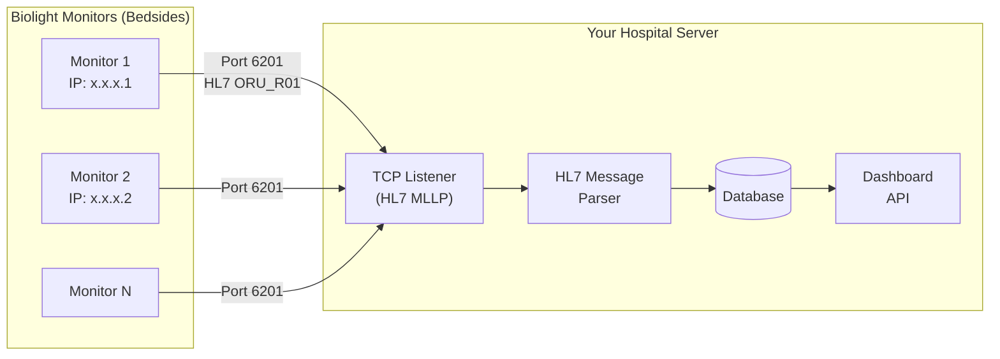

# Biolight Patient Monitor — Integration Guide

## Protocol Summary

The **Biolight PDS Protocol** exports patient vital data over **TCP/IP** using **HL7 v2.6** messages with **MLLP** (Minimal Lower Layer Protocol) framing.

> [!IMPORTANT]
> The Biolight monitor acts as both **server** and **client** depending on configuration. Your system needs to act accordingly.

---

## Architecture Overview



---

## 3 Communication Interfaces

| Interface | Port | Direction | Purpose |
|---|---|---|---|
| **Unsolicited Send** | **6201** | Monitor → Your Server | Auto-pushes vitals periodically |
| **Query Request** | **6202** | Your Server → Monitor | On-demand query for vitals/alarms |
| **Real-time Query** | **6203** | Bidirectional | Real-time subscriptions + heartbeat |

---

## Step-by-Step Integration Plan

### Phase 1: Network Setup & Basic Connection

1. **Network Configuration**
   - Ensure your server and Biolight monitors are on the **same network/VLAN**
   - Get IP addresses of all monitors (Main Menu → System Info)

2. **Monitor HL7 Configuration** (on each Biolight device)
   - Main Menu → Maintenance → Password: `300246` or `785623`
   - Network Settings → HL7
   - Set **Role** = `Client` (monitor connects TO your server)
   - Set **Target IP** = Your server's IP
   - Set **Target Port** = Your listening port (e.g., 6201)
   - Enable **Send Waveform** if needed
   - Set **Send Parameter Interval** (e.g., 5 seconds)

3. **Alternative: Your Server connects to monitors**
   - If monitors are configured as **Server** (default), connect to `<monitor_ip>:6201`

### Phase 2: Build the TCP/HL7 Receiver Server

Your server needs to:

1. **Listen for TCP connections** (or connect to monitors)
2. **Parse MLLP framing** — Messages are wrapped:
   - Start: `0x0B` (VT character)
   - End: `0x1C` + `0x0D` (FS + CR)
3. **Parse HL7 v2.6 messages** — Pipe-delimited segments
4. **Extract vital parameters from OBX segments**

### Phase 3: Parse Vital Parameters

#### Key Parameter IDs (from OBX segments)

| Parameter | ID | Module ID | Example OBX |
|---|---|---|---|
| **Heart Rate (HR)** | 201 | 5001 (ECG) | `OBX\|\|NM\|201^HR^BHC\|5001\|60\|\|\|\|\|\|F` |
| **SpO2** | 251 | 5002 | `OBX\|\|NM\|251^SPO2^BHC\|5002\|99\|\|\|\|\|\|F` |
| **Pulse Rate (PR)** | 259 | 5002 | `OBX\|\|NM\|259^PR^BHC\|5002\|60\|\|\|\|\|\|F` |
| **NIBP Systolic** | 351 | 5004 | `OBX\|\|NM\|351^NIBP S^BHC\|5004\|125\|11^mmHg^BHC\|\|\|\|\|F` |
| **NIBP Diastolic** | 352 | 5004 | `OBX\|\|NM\|352^NIBP D^BHC\|5004\|84\|...\|F` |
| **NIBP Mean** | 353 | 5004 | `OBX\|\|NM\|353^NIBP M^BHC\|5004\|96\|...\|F` |
| **Resp Rate (RR)** | 401 | 5005 (RESP) | `OBX\|\|NM\|401^RR^BHC\|5005\|20\|\|\|\|\|\|F` |
| **Temperature T1** | 1051 | 5021 (TEMP) | `OBX\|\|NM\|1051^T01^BHC\|5021\|36.6\|21^C^BHC\|\|\|\|\|F` |
| **Temperature T2** | 1052 | 5021 | `OBX\|\|NM\|1052^T02^BHC\|5021\|36.5\|...\|F` |
| **IBP Systolic** | 1501 | 5031 (IBP P1) | `OBX\|\|NM\|1501^Sys^BHC\|5031\|122\|...\|F` |
| **C.O.** | 751 | 5012 (CO) | `OBX\|\|NM\|751^C.O.^BHC\|5012\|5.2\|...\|F` |

#### Message Control IDs (MSH-10 field):

| Control ID | Message Type |
|---|---|
| 1001 | Module online/offline + supported parameters |
| 1004 | Periodic parameter values |
| 1005 | NIBP aperiodic measurement |
| 1006 | C.O. aperiodic measurement |
| 1009 | Parameter alarm limits |
| 1010 | Parameter alarm levels |
| 1011 | Parameter alarm switches |
| 1015 | Waveform data |

#### Patient Info from PID Segment:
- **PID-3**: Medical Record Number
- **PID-5**: Patient Name (`FirstName^LastName`)
- **PID-7**: Date of Birth (`YYYYMMDD`)
- **PID-8**: Sex (`M`/`F`/`U`)

#### Bed/Location from PV1 Segment:
- **PV1-3**: `<ward>^^<officeName>&<bedId>&<IP>&<IPSeq>&0`

### Phase 4: Store & Display on Dashboard

- Store parsed vitals in a time-series database (TimescaleDB, InfluxDB, or PostgreSQL)
- Build REST API endpoints for the dashboard
- Real-time updates via WebSocket to the frontend

---

## Recommended Technology Stack

| Layer | Technology | Why |
|---|---|---|
| **HL7 Receiver** | Node.js or Python | Mature HL7 parsing libraries |
| **HL7 Parser** | `python-hl7` / `node-hl7-complete` | Parse MLLP + HL7 v2.x |
| **Database** | PostgreSQL + TimescaleDB | Time-series vitals + relational patient data |
| **API** | Express.js / FastAPI | REST + WebSocket for real-time |
| **Dashboard** | React / Next.js | Real-time vital display |

---

## Sample HL7 Message (What You'll Receive)

```
<0x0B>MSH|^~\&|||||20230713104819||ORU^R01^ORU_R01|1004|P|2.6||||||UTF-8<CR>
PID|||78||Mis^Lucy^Merry||20020202|F<CR>
PV1||I|CCU^^&36&0&0|||||||||||||||A<CR>
OBR||||CMS|||20230717170425<CR>
OBX||NM|201^HR^BHC|5001|60||||||F<CR>
OBX||NM|251^SPO2^BHC|5002|99||||||F<CR>
OBX||NM|351^NIBP S^BHC|5004|125|11^mmHg^BHC|||||F||APERIODIC|20230717165605<CR>
OBX||NM|352^NIBP D^BHC|5004|84|11^mmHg^BHC|||||F||APERIODIC|20230717165605<CR>
OBX||NM|401^RR^BHC|5005|20||||||F<CR>
OBX||NM|1051^T01^BHC|5021|36.6|21^C^BHC|||||F<CR>
<0x1C><0x0D>
```

**Parsed output:**
- Patient: Lucy Merry (MRN: 78), DOB: 2002-02-02, Female
- HR: 60 bpm | SpO2: 99% | NIBP: 125/84 mmHg | RR: 20 | Temp: 36.6°C

---

## Questions for You Before Proceeding

Before I can write the actual server code, I need clarification on:

1. **What is your preferred backend language?** (Node.js / Python / C# / Java?) — I can build the HL7 receiver in any of these.

2. **How many monitors** will you integrate? (affects architecture — single vs. multi-device handling)

3. **Monitor role configuration**: Will monitors connect TO your server (monitors as **Clients**), or will your server connect to each monitor (monitors as **Servers** on port 6201)?

4. **Dashboard**: Do you already have a dashboard, or should I build one from scratch? What framework is it built on?

5. **Which vitals do you need?** All parameters, or only specific ones like HR, SpO2, NIBP, RR, Temp?

6. **Do you need waveform data** (real-time ECG/SpO2 waveforms) or just the numeric parameter values?

7. **Database preference**: Do you already have a database set up, or should I choose one?

8. **Deployment**: Will this run on a local hospital server, or a cloud server?
