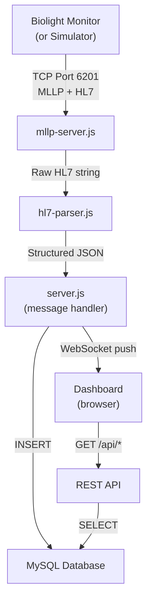

# Biolight HL7 Server — Complete Guide

## Part 1: Server Code Structure

```
d:\Chipl\BioLite\server\
│
├── server.js               ← 🚀 MAIN ENTRY POINT (start here)
├── .env                     ← ⚙️ Configuration (MySQL creds, ports)
├── package.json             ← 📦 Dependencies list
│
├── config/
│   └── db.js                ← 🗄️ MySQL connection pool
│
├── hl7/                     ← 🏥 The core HL7 protocol layer
│   ├── mllp-server.js       ← 📡 TCP server with MLLP framing
│   ├── hl7-parser.js        ← 🔬 Parses HL7 messages into JSON
│   └── biolight-mapper.js   ← 🗺️ Parameter ID lookup tables
│
├── models/
│   └── database.js          ← 💾 DB schema + read/write operations
│
├── routes/
│   └── api.js               ← 🌐 REST API endpoints
│
├── websocket/
│   └── ws-handler.js        ← ⚡ Real-time push to dashboard
│
├── simulator/
│   └── hl7-simulator.js     ← 🧪 Fake Biolight monitor for testing
│
└── public/                  ← 🖥️ Dashboard frontend
    ├── index.html
    ├── style.css
    └── app.js
```

### What Each File Does

#### [server.js](file:///d:/Chipl/BioLite/server/server.js) — The Brain
Starts everything in order:
1. Connects to MySQL → creates database + tables
2. Starts Express HTTP server (port 3000) → serves dashboard + API
3. Starts WebSocket server → real-time updates
4. Starts MLLP TCP server (port 6201) → listens for HL7 messages
5. When a message arrives: **Parse → Store → Broadcast**

#### [hl7/mllp-server.js](file:///d:/Chipl/BioLite/server/hl7/mllp-server.js) — TCP Listener
The Biolight monitor sends data over raw **TCP** (not HTTP). This file:
- Listens on port **6201** for TCP connections
- Handles **MLLP framing** — each HL7 message is wrapped with special bytes:
  - Start: `0x0B` | Message content | End: `0x1C 0x0D`
- Buffers incoming data (TCP can split messages across packets)
- Emits complete messages to the parser

#### [hl7/hl7-parser.js](file:///d:/Chipl/BioLite/server/hl7/hl7-parser.js) — Message Decoder
Takes raw HL7 text like:
```
MSH|^~\&|||||20230713||ORU^R01|1004|P|2.6||||||UTF-8
PID|||78||Rajesh^Kumar||19850315|M
OBX||NM|201^HR^BHC|5001|72||||||F
```
And converts it into structured JSON:
```json
{
  "patient": { "mrn": "78", "firstName": "Rajesh", "lastName": "Kumar" },
  "vitals": [{ "parameterName": "HR", "value": 72, "unit": "bpm" }]
}
```

#### [hl7/biolight-mapper.js](file:///d:/Chipl/BioLite/server/hl7/biolight-mapper.js) — Rosetta Stone
Maps Biolight's numeric IDs to readable names:
- Parameter `201` → **Heart Rate (HR)**
- Module `5001` → **ECG**
- Message Control `1004` → **Periodic vital values**
- All IDs come from the protocol PDF Appendix A

#### [models/database.js](file:///d:/Chipl/BioLite/server/models/database.js) — Data Storage
- Auto-creates 5 MySQL tables on first run
- Functions to insert/read patients, vitals, alarms, waveforms

#### [routes/api.js](file:///d:/Chipl/BioLite/server/routes/api.js) — REST API
- `GET /api/dashboard` — all patients with latest vitals
- `GET /api/patients/:mrn/vitals` — latest vitals for one patient
- `GET /api/patients/:mrn/alarms` — recent alarms

#### [websocket/ws-handler.js](file:///d:/Chipl/BioLite/server/websocket/ws-handler.js) — Live Push
- When new vitals arrive → instantly pushes to all open dashboards
- No polling needed — dashboard updates in real-time

#### [simulator/hl7-simulator.js](file:///d:/Chipl/BioLite/server/simulator/hl7-simulator.js) — Test Tool
- Pretends to be a Biolight monitor
- Connects to your server on port 6201
- Sends realistic HL7 messages every 5 seconds
- Generates random HR, SpO2, NIBP, RR, Temp, ECG waveforms

---

## Part 2: How Data Flows



---

## Part 3: Monitor Server/Client Mode

### How to Check The Current Mode

On the Biolight monitor device:
1. Tap **[Main Menu]** on the monitor screen
2. Tap **[Maintenance]**
3. Enter password: **`300246`** or **`785623`**
4. Tap **[Network Settings]**
5. Tap **[HL7]** tab
6. Look at the **[Role]** field — it will say either **Server** or **Client**

### What Each Mode Means

| Mode | Monitor Does | Your Laptop Does | Who Connects To Whom |
|---|---|---|---|
| **Server** (default) | Listens on port **6201** | Your code connects TO the monitor | Laptop → Monitor |
| **Client** | Connects TO your laptop | Your code listens on port **6201** | Monitor → Laptop |

### Which Mode Should You Use?

> [!IMPORTANT]
> **Use Client mode on the monitor** — this is easier and more reliable.

In **Client mode**, the monitor automatically connects to your laptop and keeps reconnecting if the connection drops. Your laptop just needs to listen — which is exactly what our server does.

### How to Set Client Mode on Monitor

1. Main Menu → Maintenance → Password: `300246`
2. Network Settings → HL7
3. Set **Role** → [Client](file:///d:/Chipl/BioLite/server/hl7/mllp-server.js#146-149)
4. Set **Target IP** → Your laptop's IP address (see next section)
5. Set **Target Port** → `6201`
6. Enable **Send Waveform** if you want ECG data
7. Set **Send Parameter Interval** → `5` (seconds)

---

## Part 4: Network Setup — Step by Step

### Step 1: Connect Both Devices to Same Network

```
   ┌──────────────┐
   │  WiFi Router  │
   │  / Switch     │
   └──┬────────┬───┘
      │        │
      │        │
  ┌───┴───┐  ┌─┴──────────┐
  │Laptop │  │ Biolight   │
  │(Server)│  │ Monitor    │
  └───────┘  └────────────┘
```

**Option A: Both on WiFi**
- Connect your laptop to the hospital/office WiFi
- Connect the Biolight monitor to the same WiFi
- Both get IPs from the router (e.g., 192.168.1.x)

**Option B: Direct Ethernet (Recommended for Testing)**
- Connect a LAN cable directly between your laptop and the monitor
- Set static IPs on both (see Step 2)

**Option C: Both wired to same switch/router**
- Plug both into the same router/switch with ethernet cables

### Step 2: Find Your Laptop's IP Address

Open **Command Prompt** and run:
```
ipconfig
```

Look for your **IPv4 Address** under your network adapter:
```
Wireless LAN adapter Wi-Fi:
   IPv4 Address. . . . . . . : 192.168.1.105   ← THIS IS YOUR IP
```

> [!TIP]
> If using direct ethernet cable, set a static IP on your laptop:
> Control Panel → Network → Ethernet → Properties → IPv4 →
> IP: `192.168.1.100`, Subnet: `255.255.255.0`
> Then set the monitor's IP to `192.168.1.101` (same subnet)

### Step 3: Find the Monitor's IP Address

On the Biolight monitor:
1. Tap **[Main Menu]**
2. Tap **[System Info]**
3. Note the **IP Address** shown (e.g., `192.168.1.50`)

### Step 4: Verify Connectivity

From your laptop, open Command Prompt and **ping the monitor**:
```
ping 192.168.1.50
```

If you see replies — ✅ you're connected. If timeout — ❌ check the network.

### Step 5: Configure the Monitor (Client Mode)

1. Main Menu → Maintenance → Password: `300246`
2. Network Settings → HL7
3. **Role** = [Client](file:///d:/Chipl/BioLite/server/hl7/mllp-server.js#146-149)
4. **Target IP** = `192.168.1.105` ← your laptop's IP
5. **Target Port** = `6201`
6. **Send Parameter Interval** = `5` seconds
7. Optionally enable **Send Waveform**

### Step 6: Start the Server on Your Laptop

```bash
cd d:\Chipl\BioLite\server
node server.js
```

### Step 7: Verify Data Reception

- Server console should show: `[MLLP] Monitor connected`
- Then vitals should start appearing: `[HL7] ← PERIODIC_VALUES | Patient: ...`
- Open browser: `http://localhost:3000` — see live dashboard

### Step 8: (Testing Without Monitor)

If you don't have the monitor yet, use the simulator:
```bash
# Terminal 1: Start server
cd d:\Chipl\BioLite\server
node server.js

# Terminal 2: Start simulator
cd d:\Chipl\BioLite\server
node simulator/hl7-simulator.js
```

---

## Part 5: Troubleshooting

| Problem | Solution |
|---|---|
| `MySQL connection refused` | Start XAMPP → click "Start" next to MySQL |
| `EADDRINUSE port 6201` | Another process using port 6201. Kill it or change `MLLP_PORT` in [.env](file:///d:/Chipl/BioLite/server/.env) |
| Monitor not connecting | Check Role=Client, Target IP = your laptop IP, both on same network |
| `ping` fails | Check firewall, ensure both on same subnet (192.168.1.x) |
| No data showing on dashboard | Check browser console (F12) for WebSocket errors |
| Dashboard shows but no vitals | Verify MLLP messages are being received (check server terminal logs) |
